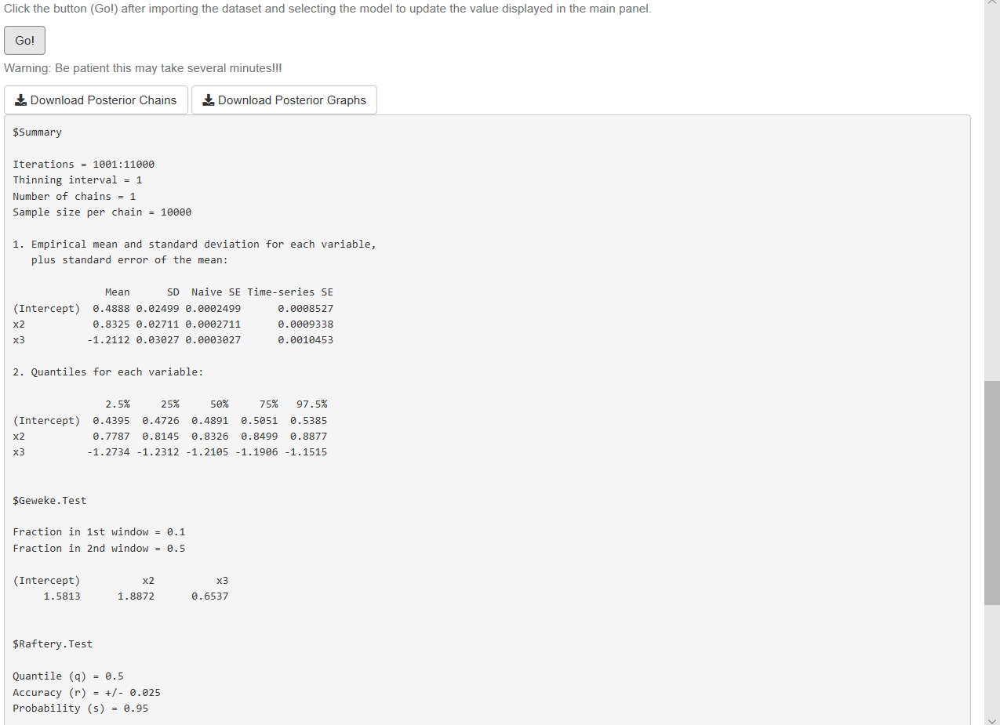

```{r setup, include = FALSE}
library(svglite)
knitr::opts_chunk$set(echo = TRUE,
                      dev = "svglite",
                      fig.ext = ".svg"
                      )
options(knitr.graphics.auto_pdf = TRUE)
```

# Univariate regression {#unireg}

We will describe how to perform Bayesian inference in univariate models: normal-inverse gamma, logit, probit, multinomial probit and logit, ordered probit, negative binomial, tobit, quantile regression, and Bayesian bootstrap in linear models. We show their formal framework, some applications, and how to perform inference using our GUI as well as R. We will also have mathematical and computational exercises in our GUI and in R.

## Normal model

The Gaussian linear model specifies ${\bf{y}}={\bf{X}}\beta+\bf{\mu}$ such that $\bf{\mu}\sim N(\bf{0},\sigma^2\bf{I}_N)$ is an stochastic error, ${\bf{X}}$ is a $N \times K$ matrix of regressors, $\beta$ is a $K$-dimensional vector of coefficients, ${\bf{y}}$ is an $N$-dimensional vector of a dependent variable, and $N$ is the number of units.

The conjugate independent priors for the parameters are
$\beta \sim N(\beta_0, {\bf{B}}_0)$ and 
$\sigma^2 \sim IG(\alpha_0/2, \delta_0/2)$. Given the likelihood function, $p(\beta, \sigma^2|{\bf{y}}, {\bf{X}}) = (2\pi\sigma^2)^{-\frac{N}{2}} \exp \left\{-\frac{1}{2\sigma^2} ({\bf{y}} - \bf{X\beta})^{\top}({\bf{y}} - \bf{X\beta}) \right\}$, the conditional posterior distributions are

\begin{align}
\beta|\sigma^2, {\bf{y}}, {\bf{X}} \sim N(\beta_n, \sigma^2{\bf{B}}_n),
\end{align}
and
\begin{align}
\sigma^2|\beta, {\bf{y}}, {\bf{X}} \sim IG(\alpha_n/2, \delta_n/2),
\end{align}

\noindent where ${\bf{B}}_n = ({\bf{B}}_0^{-1} + \sigma^{-2} {\bf{X}}^{\top}{\bf{X}})^{-1}$, $\beta_n= {\bf{B}}_n({\bf{B}}_0^{-1}\beta_0 + \sigma^{-2} {\bf{X}}^{\top}{\bf{y}})$, $\alpha_n = \alpha_0 + N$ and $\delta_n = \delta_0 + ({\bf{y}}-{\bf{X}}\beta)^{\top}({\bf{y}}-{\bf{X}}\beta)$.

We can employ the Gibbs sampler in this model due to having standard conditional posterior distributions.

**Application: The market value of soccer players in Europe**

Let's analyze the determinants of the market value of soccer players. In particular, we use the dataset *1ValueFootballPlayers.csv* which is in folder *DataApp* (see Table \@ref(tab:tabDataApp) for details) in our github repository [(https://github.com/besmarter/BSTApp)](https://github.com/besmarter/BSTApp). This dataset was used by [@Serna2018] to finding the determinants of high performance soccer players in the five most important national leagues in Europe.

The specification of the model is

\begin{align}
\log(\text{Value}_i)&=\beta_1+\beta_2\text{Perf}_i+\beta_3\text{Perf}^2_i+\beta_4\text{Age}_i+\beta_5\text{Age}^2_i+\beta_6\text{NatTeam}_i+\beta_7\text{Goals}_i\\
&+\beta_8\text{Goals}^2_i+\beta_9\text{Exp}_i+\beta_{10}\text{Exp}^2_i+\beta_{11}\text{Assists}_i,
\end{align}

where *Value* is the market value in Euros (2017), *Perf* is a measure of performance, *Age* is the players' age in years, *NatTem* is an indicator variable that takes the value of 1 if the player has been on the national team, *Goals* is the number of goals scored by the player during his career, *Exp* is his experience in years, and *Assists* is the number of assist made by the player in the 2015--2016 season. 

We assume that the dependent variable distributes normal, then we use a normal-inverse gamma model using vague conjugate priors where ${\bf{B}}_0=1000{\bf{I}}_{10}$, $\beta_0={\bf{0}}_{10}$, $\alpha_0=0.001$ and $\delta_0=0.001$. We perform a Gibbs sampler with 10,000 MCMC iterations plus a burn-in equal to 5,000, and a thinning parameter equal to 1.

```{r}
set.seed(010101) # Set a seed for replicability of results
# Download data from github
# urlfile <- 'https://raw.githubusercontent.com/besmarter/BSTApp/master/DataApp/1ValueFootballPlayers.csv'
# mydata <- read.csv(urlfile)
mydata <- read.csv("DataApplications/1ValueFootballPlayers.csv", header = T, sep = ",")
attach(mydata)
str(mydata)
y <- log(Value) # Dependent variable
X <- cbind(1,as.matrix(mydata[, 4:13])) # Regressors
N <- dim(X)[1] # Sample size
K <- dim(X)[2] # Number of regressors including a constant

# Hyperparameters
B0 <- 1000*diag(K) # Prior covariance matrix Normal distribution
B0i <- solve(B0) # Prior precision matrix Normal distribution 
b0 <- rep(0,K) # Prior mean Normal distribution
a0 <- 0.001 # Prior shape parameter inverse-gamma distribution
d0 <- 0.001 # Prior rate parameter inverse-gamma distribution 

# MCMC parameters
it <- 10000 # Iterations after burn-in
burn <- 5000 # Burn-in
tot <- burn + it # Total iterations

###### 1. Programming the Gibbs sampler #######
# Space and initial setting
betaGibbs <- matrix(0,tot,K) # Space for posterior beta
varGibbs <- matrix(1,tot,1) # Space for posterior sigma^2
sigma2_0 <- 2 # Initial sigma^2
Bn <- solve(B0i+sigma2_0^{-1}*t(X)%*%X) # Initial covariance matrix beta
bn <- Bn%*%(B0i%*%b0+sigma2_0^{-1}*t(X)%*%y) # Initial mean beta
an <- a0+N # Posterior alpha
for(i in 1:tot){
  BetaG <- MASS::mvrnorm(1, mu=bn, Sigma=Bn) # Draw of posterior beta
  dn <- d0+t(y-X%*%BetaG)%*%(y-X%*%BetaG) # Posterior delta
  sigma2 <- pscl::rigamma(1,an/2,dn/2) # Draw of posterior variance
  Bn <- solve(B0i+sigma2^{-1}*t(X)%*%X) # Posterior covariance beta
  bn <- Bn%*%(B0i%*%b0+sigma2^{-1}*t(X)%*%y) # Posterior mean beta
  betaGibbs[i,] <- BetaG
  varGibbs[i,] <- sigma2
}
# Draws after burn-in
PostPar <- coda::mcmc(cbind(betaGibbs[burn:it,], varGibbs[burn:it,]))
# Names
colnames(PostPar) <- c("Cte", names(mydata)[-c(1:3)], "Variance")
# Summary posterior draws
summary(PostPar) 
# Trace and density plots
plot(PostPar)
# Autocorrelation plots
coda::autocorr.plot(PostPar)
# Convergence diagnostics
coda::geweke.diag(PostPar)
coda::raftery.diag(PostPar,q=0.5,r=0.025,s = 0.95)
coda::heidel.diag(PostPar)

###### 2. Using a library: MCMCpack #######
Reg <- MCMCpack::MCMCregress(y~X-1, burnin = burn, mcmc = it, b0 = b0, B0 = B0i, c0 = a0, d0 = d0)
summary(Reg)
```

When using our GUI (third approach), the first step is to type **shiny::runGitHub("besmarter/BSTApp" , launch.browser=T)** in the R package console or any R code editor to run our GUI,^[I strongly recommend to type the code line rather than copy and paste it.] and then select *Univariate Models* on the top panel. The radio button on the left hand side shows the specific models inside this generic class. Users should select *Normal* model (see Figure \@ref(fig:Fig1)). 

(ref:Fig1) Univariate models: Normal/normal-inverse gamma model.

```{r Fig1, echo=FALSE, out.width = '80%', fig.align = 'center', fig.cap="(ref:Fig1)"}
knitr::include_graphics("images/Figure1.png")
```

The right hand side panel displays a widget to upload the input dataset, which should be a csv file with headers in the first row. Users also should select the kind of separator used in the input file: comma, semicolon, or tab (use the folders *DataSim* and *DataApp* for the input file templates). Once users upload the dataset, they can see a data preview. Range sliders help to set the number of iterations of the MCMC and the amount of burn-in, and the thinning parameter can be selected as well. After this, users should specify the equation. This can be done with the formula builder, where users can select the dependent variable, and the independent variables, and then click on the "Build formula" tab. Users can see in the "Main Equation" space the formula expressed in the format used by R. See Main equation box in Figure \@ref(fig:Fig2), observe that in this case the depedent variable is $\log\text{Value}$ rather than $\text{Value}$, then we should modify directly the Main equation box writing $log(Value)$. In general, users can modify this box if necessary, for instance, including higher order or interaction terms, other transformation are also allowed. This is done directly in the "Main Equation" space taking into account that this extra terms should follow formula command structure (see https://www.rdocumentation.org/packages/stats/versions/3.6.2/topics/formula). Note that the class of univariate models includes the intercept by default, except ordered probit, where the specification has to do this explicitly, that is, ordered probit models do not admit an intercept for identification issues (see below). Finally, users should define the hyperparameters of the prior; for instance, in the normal-inverse gamma model, these are the mean, covariance, shape, and scale (see Figure \@ref(fig:Fig2)). However, users should take into account that our GUI has "non-informative'' hyperparameters by default in all our modelling frameworks, so the last part is not a requirement.

(ref:Fig2) Normal/normal-inverse gamma model: Formula builder and hyperparameters.

```{r Fig2, echo=FALSE, out.width = '80%', fig.align = 'center', fig.cap="(ref:Fig2)"}
knitr::include_graphics("images/Figure2.png")
```

After this specification process, users should click the *Go!* button to initiate the estimation. Our GUI displays the summary statistics and convergence diagnostics after this process is finished (see Figure \@ref(fig:Fig3)). There are also widgets to download posterior chains (csv file) and graphs (pdf and eps files). Note that the order of the coefficients in the results (summary, posterior chains, and graphs) is first for the location parameters, and then for the scale parameters.

(ref:Fig3) Normal/normal-inverse gamma model: Results.

```{r Fig3, echo=FALSE, out.width = '80%', fig.align = 'center', fig.cap="(ref:Fig3)"}
knitr::include_graphics("images/Figure3.png")
```


As expected, the results using the three approach (programming, library and GUI) are very similar. These suggest that age, squared age, national team, goals, experience, and squared experience are relevant regressors. For instance, we found that the 2.5\% and 97.5\% percentiles of the posterior estimate associated with the variable Goals are 4.57e-03 and 1.82e-02. These values can be used to find the 95\% symmetric credible interval. This means that there is a 0.95 probability that the population parameter lies in (4.57e-03, 1.82e-02), which would suggest that this variable is relevant to explain the market value of a soccer player.^[Users should take into account that formal inference (hypothesis tests) in a Bayesian framework is based on Bayes factors.] We also found that the effect of having been on the national team has a 95\% credible interval equal to (0.58, 1.04) with a median equal to 0.81, that is, an increase of the market value of the player of 124.8\% ($\exp(0.81)-1$) compared with a player that has not ever been on a national team. The posterior distribution of this variable can be seen in Figure \@ref(fig:Fig10). This graph is automatically generated by the GUI, and can be downloaded in the zip file named *Posterior Graphs.csv*; but we should take into account that the national team is the sixth variable, remember that by default the intercept is the first variable.

(ref:Fig10) Posterior distribution: National team.

```{r Fig10, echo=FALSE, out.width = '50%', fig.align = 'center', fig.cap="(ref:Fig10)"}
knitr::include_graphics("images/Fig1.png")
```

We show all the posterior densities as well as the trace and correlation plots to visualize convergence of the posterior chains. Trace plots look stable, and autocorrelation plots decrease very quickly. In addition, convergence statistics (Geweke's [@Geweke1992],  Raftery and Lewis [@Raftery1992], and Heidelberger and Welch's tests [@Heidelberger1983]) suggest that the posterior draws come from stationary distributions (see Chapter \@ref(diag) for technical details). 

## Logit model

In the logit model the dependent variable is binary, $Y_i=\left\{1,0\right\}$, then it follows a Bernoulli distribution, $Y_i\stackrel{ind} {\thicksim}B(\pi_i)$, that is, $p(Y_i=1)=\pi_i$, such that $\pi_i=\frac{\exp\left\{{\bf{x}}_i^{\top}\beta\right\}}{1+\exp\left\{{\bf{x}}_i^{\top}\beta\right\}}$.

The likelihood function of the logit model is

\begin{align}
  p(\mathbf{y}|\beta,\mathbf{X})&=\prod_{i=1}^N \pi_i^{y_i}(1-\pi_i)^{1-y_i}\\
  &=\prod_{i=1}^N\left(\frac{\exp\left\{{\bf{x}}_i^{\top}\beta\right\}}{1+\exp\left\{{\bf{x}}_i^{\top}\beta\right\}}\right)^{y_i}\left(\frac{1}{1+\exp\left\{{\bf{x}}_i^{\top}\beta\right\}}\right)^{1-y_i}.
\end{align}

I specify a Normal distribution as prior, $\beta\sim N({\bf{\beta}}_0,{\bf{B}}_0)$. Then, the posterior distribution is

\begin{align}
  \pi(\beta|\mathbf{y},\mathbf{X})&\propto\prod_{i=1}^N\left(\frac{\exp\left\{{\bf{x}}_i^{\top}\beta\right\}}{1+\exp\left\{{\bf{x}}_i^{\top}\beta\right\}}\right)^{y_i}\left(\frac{1}{1+\exp\left\{{\bf{x}}_i^{\top}\beta\right\}}\right)^{1-y_i}\times\exp\left\{-\frac{1}{2}(\beta-\beta_0)^{\top}\mathbf{B}_0(\beta-\beta_0)\right\}.
\end{align}

The logit model does not have a standard posterior distribution. Then, a random walk Metropolis--Hastings algorithm can be used to obtain draws from the posterior distribution. A potential proposal is a multivariate Normal centered at the current value, with covariance matrix $\tau^2({\bf{B}}_0^{-1}+\widehat{{\bf{\Sigma}}}^{-1})^{-1}$, where $\tau>0$ is a tuning parameter and $\widehat{\bf{\Sigma}}$ is the sample covariance matrix from the maximum likelihood estimation [@Martin2011].^[Tuning parameters should be set in a way such that one obtains reasonable diagnostic criteria and aceptation rates.]

Observe that $\log(p(\mathbf{y}|\beta,\mathbf{X}))=\sum_{i=1}^Ny_i{\bf{x}}_i^{\top}\beta-\log(1+\exp({\bf{x}}_i^{\top}\beta))$. I am going to use this expression when calculating the acceptance parameter in the computational implementation of the Metropolist-Hastings algorithm. In particular, the acceptance parameter is $\alpha=\min\left\{1, \exp(\log(p(\mathbf{y}|\beta^{c},\mathbf{X}))+\log(\pi(\beta^c))-(\log(p(\mathbf{y}|\beta^{(s-1)},\mathbf{X}))+\log(\pi(\beta^{(s-1)}))))\right\}$, where $\beta^c$ and $\beta^{(s-1)}$ are draws from the proposal distribution and previous iteration of the Markov chain, respectively.^[Formulating the acceptance rate using $\log$ helps to mitigate computational problems.]

**Simulation**

Let's do a simulation exercise to check the performance of the algorithms. Set $\beta=\begin{bmatrix}0.5 & 0.8 & -1.2\end{bmatrix}^{\top}$, $\mathbf{x}_{ik}\sim N(0,1)$, $k=2,3$ and $i=1,2,\dots,10000$.

```{r}
set.seed(010101) # Set a seed for replicability of results
N <- 10000 # Sample size
B <- c(0.5, 0.8, -1.2) # Population location parameters
x2 <- rnorm(N) # Regressor
x3 <- rnorm(N) # Regressor
X <- cbind(1, x2, x3) # Regressors
XB <- X%*%B
PY <- exp(XB)/(1 + exp(XB)) # Probability of Y = 1
Y <- rbinom(N, 1, PY) # Draw Y's
table(Y) # Frequency
write.csv(cbind(Y, x2, x3), file = "DataSimulations/LogitSim.csv") # Export data

###### 1. Programming the M-H sampler #######
# This function sets the M-H sampler using as default a hyperparameter mean equal to 0
# and a covariance equal to 1000 times a identity matrix, a tunning parameter equal to 1,
# 1000 post burn-in iterations, and the latter is equal to 500.
MHfunc <- function(y, X, b0 = rep(0, dim(X)[2] + 1), B0 = 1000*diag(dim(X)[2] + 1), tau = 1, 
                   iter = 1000, burnin = 500){
  Xm <- cbind(1, X) # Regressors
  K <- dim(Xm)[2] # Number of location parameters
  BETAS <- matrix(0, iter + burnin, K) # Space for posterior chains
  Reg <- glm(y ~ Xm - 1, family = binomial(link = "logit")) # Maximum likelihood estimation
  BETA <- Reg$coefficients # Maximum likelihood parameter estimates 
  tot <- iter + burnin # Total iterations M-H algorithm
  COV <- vcov(Reg) # Maximum likelihood covariance matrix
  COVt <- tau^2*solve(solve(B0) + solve(COV)) # Covariance matrix for the proposal distribution
  Accep <- rep(0, tot) # Space for calculating the acceptance rate
  # create progress bar in case that you want to see iterations progress
  # pb <- winProgressBar(title = "progress bar", min = 0,
  #                      max = tot, width = 300)
  for(it in 1:tot){
    BETAc <- BETA + MASS::mvrnorm(n = 1, mu = rep(0, K), Sigma = COVt) # Candidate location parameter
    likecand <- sum((Xm%*%BETAc) * Y - apply(Xm%*%BETAc, 1, function(x) log(1 + exp(x)))) # Log likelihood for the candidate
    likepast <- sum((Xm%*%BETA) * Y - apply((Xm%*%BETA), 1, function(x) log(1 + exp(x)))) # Log lkelihood for the actual draw
    priorcand <- (-1/2)*crossprod((BETAc - b0), solve(B0))%*%(BETAc - b0) # Log prior for candidate
    priorpast <- (-1/2)*crossprod((BETA - b0), solve(B0))%*%(BETA - b0) # Log prior for actual draw
    alpha <- min(1, exp(likecand + priorcand - likepast - priorpast)) #Probability of selecting candidate
    u <- runif(1) # Decision rule for selecting candidate
    if(u < alpha){
      BETA <- BETAc # Changing reference for candidate if selected
      Accep[it] <- 1 # Indicator if the candidate is accepted
    } 
    BETAS[it, ] <- BETA # Saving draws
    # setWinProgressBar(pb, it, title=paste( round(it/tot*100, 0),
    #                                       "% done"))
  }
  # close(pb)
  return(list(Bs = BETAS[-c(1:burnin), ], AceptRate = mean(Accep)))
}
Posterior <- MHfunc(y = Y, X = cbind(x2, x3), iter = 100, burnin = 5) # Runing our M-H function changing some default parameters.
paste("Acceptance rate equal to", round(Posterior$AceptRate, 2), sep = " ")
PostPar <- coda::mcmc(Posterior$Bs)
# Names
colnames(PostPar) <- c("Cte", "x1", "x2")
# Summary posterior draws
summary(PostPar)
# Trace and density plots
plot(PostPar)
# Autocorrelation plots
coda::autocorr.plot(PostPar)
# Convergence diagnostics
coda::geweke.diag(PostPar)
coda::raftery.diag(PostPar,q=0.5,r=0.025,s = 0.95)
coda::heidel.diag(PostPar)

###### 2. Using a library: MCMCpack #######
RegLog <- MCMCpack::MCMClogit(Y~X-1, burnin = 1000, mcmc = 10000, b0 = rep(0, 3), B0 = 1000^(-1)*diag(3), tune = 1, thin = 1)
summary(RegLog)
```

When using our GUI to estimate this model, we should follow these steps:

1. Select univariate models on the top panel
2. Select logit models using the left radio button
3. Upload the data set (we save this in folder *DataSimulations* in file *LogitSim.csv*)
4. Select MCMC iterations, burn-in and thinning parameters
5. Select dependent and independent variables (see Figure \@ref(fig:Fig4))
6. Click the *Build formula* button
7. Set the hyperparameters and the tunning parameter
8. Click the *Go!* button
9. Analyze results (see Figure \@ref(fig:Fig5))
10. Download posterior chains and diagnostic plots

(ref:Fig4) Univariate models: Logit/normal model

```{r Fig4, echo=FALSE, out.width = '80%', fig.align = 'center', fig.cap="(ref:Fig4)"}
knitr::include_graphics("images/Figure4.png")
```

We observe from our results that all 95\% credible intervals embrace the population parameters. We also observe that there is a high level of autocorrelation (see autocorrelation plots) that potentially increases the dependence factor in the Raftery test (dependence factors higher than 5 are worrisome). Dependence factors are the proportional increase in the number of iterations attributable to serial dependence. Although, other diagnostics seem to be right (see Chapter \@ref(diag) for details). We can potentially mitigate convergence issues running longer chains or multiple chains, using a thinning parameter greater than 1, picking a better tunning parameter or improving the mixing properties of the model using better priors or performing better math. 

(ref:Fig5) Logit/normal model: Results.

```{r Fig5, echo=FALSE, out.width = '80%', fig.align = 'center', fig.cap="(ref:Fig5)"}

```

## Probit model

The probit model also has as dependent variable a binary outcome.
There is a latent (unobserved) random variable, $Y_i^*$, that defines the structure of the estimation problem $Y_i=\begin{Bmatrix} 1, & Y_i^* \geq 0\\
0, & Y_i^* < 0 \end{Bmatrix},$

where $Y_i^*={\bf{x}}_i^{\top}\beta+\mu_i$, $\mu_i\stackrel{iid} {\sim}N(0,1)$. Then, 

\begin{align}
P[Y_i=1]&=P[Y_i^*\geq 0]\\
        &=P[\mathbf{x}_i^{\top}\beta+\mu_i\geq 0]\\
        &=P[\mu_i\geq -\mathbf{x}_i^{\top}\beta]\\
        &=1-P[\mu_i < -\mathbf{x}_i^{\top}\beta]\\
        &=P[\mu_i < \mathbf{x}_i^{\top}\beta],
\end{align}

where the last equality follows by symmetry at 0. In addition, observe that the previous calculations do not change if we multiply $Y_i^*$ by a positive constant, this implies identification issues regarding scale. Intuitively, this is because we just observe 0's or 1's that are driven by an unobserved random latent variable $Y_i^*$, this issue is also present in the logit model, that is why we set the variance equal to 1.

[@albert1993bayesian] implemented data augmentation [@Tanner1987] to apply a Gibbs sampling algorithm in this model. Augmenting this model with $Y_i^*$, we can have the likelihood contribution from observation $i$, $p(y_i|y_i^*)=1_{y_i=0}1_{y_i^*\leq 0}+1_{y_i=1}1_{y_i^*> 0}$, where $1_A$ is an indicator function that takes the value of 1 when condition $A$ is satisfied.

The posterior distribution is $\pi(\beta,{\bf{Y^*}}|{\bf{y}},{\bf{X}})\propto\prod_{i=1}^n\left[\mathbf{1}_{y_i=0}1_{y_i^*< 0}+1_{y_i=1}1_{y_i^*\geq 0}\right] \times N_N({\bf{Y}}^*|{\bf{X}\beta},{\bf{I}}_N)\times N_K(\beta|\beta_0,{\bf{B}}_0)$ when taking a normal distribution as prior, $\beta\sim N(\beta_0,{\bf{B}}_0)$.

The conditional posterior distribution of the latent variable is

\begin{align}
Y_i^*|\beta,{\bf{y}},{\bf{X}}&\sim\begin{Bmatrix}
TN_{[0,\infty)}({\bf{x}}_i^{\top}\beta,1), & y_i= 1\\
TN_{(-\infty,0)}({\bf{x}}_i^{\top}\beta,1), & y_i= 0 \\
\end{Bmatrix},
\end{align}

where $TN_A$ denotes a truncated normal density in the interval $A$.

The conditional posterior distribution of the location parameters is

\begin{align}
\beta|{\bf{Y}}^*, {\bf{X}} & \sim N(\beta_n,\bf{B}_n), 
\end{align}

where ${\bf{B}}_n = ({\bf{B}}_0^{-1} + {\bf{X}}^{\top}{\bf{X}})^{-1}$, and $\beta_n= {\bf{B}}_n({\bf{B}}_0^{-1}\beta_0 + {\bf{X}}^{\top}{\bf{Y}}^*)$.

**Application: Determinants of hospitalization in Medellín**

We use the dataset named *2HealthMed.csv*, which is in folder *DataApp* (see Table 13.3 for details) in our github repository [(https://github.com/besmarter/BSTApp)](https://github.com/besmarter/BSTApp) and was used by [@Ramirez2013]. Our dependent variable is a binary indicator with a value equal to 1 if an individual was hospitalized in 2007, and 0 otherwise.

The specification of the model is
\begin{align}
\text{Hosp}_i&=\beta_1+\beta_2\text{SHI}_i+\beta_3\text{Female}_i+\beta_4\text{Age}_i+\beta_5\text{Age}_i^2+\beta_6\text{Est2}_i+\beta_7\text{Est3}_i\\
&+\beta_8\text{Fair}_i+\beta_9\text{Good}_i+\beta_{10}\text{Excellent}_i,
\end{align}

where *SHI* is a binary variable equal to 1 if the individual is in a subsidized health care program and 0 otherwise, *Female* is an indicator of gender, *Age* in years, *Est2* and *Est3* are indicators of socio-economic status, the reference is *Est1*, which is the lowest, and self perception of health status where *bad* is the reference.

Let's set $\beta_0={\bf{0}}_{10}$, ${\bf{B}}_0={\bf{I}}_{10}$, iterations, burn-in and thinning parameters equal to 10000, 1000 and 1, respectively.

```{r}
mydata <- read.csv("DataApplications/2HealthMed.csv", header = T, sep = ",")
attach(mydata)
str(mydata)
K <- 10 # Number of regressors
b0 <- rep(0, K) # Prio mean
B0i <- diag(K) # Prior precision (inverse of covariance)
Prior <- list(betabar = b0, A = B0i) # Prior list
y <- Hosp # Dependent variables
X <- cbind(1, SHI, Female, Age, Age2, Est2, Est3, Fair, Good, Excellent) # Regressors
Data <- list(y = y, X = X) # Data list
Mcmc <- list(R = 10000, keep = 1, nprint = 0) # MCMC parameters
RegProb <- bayesm::rbprobitGibbs(Data = Data, Prior = Prior, Mcmc = Mcmc) # Inference using bayesm package
PostPar <- coda::mcmc(RegProb$betadraw) # Posterior draws
colnames(PostPar) <- c("Cte", "SHI", "Female", "Age", "Age2", "Est2",
                       "Est3", "Fair", "Good", "Excellent") # Names
summary(PostPar) # Posterior summary
```

It seems from our results that female and health status are relevant variables for hospitalization, as their 95\% credible intervals do not cross 0. Women have a higher probability of being hospitalized than do men, and people with bad self perception of health condition also have a higher probability of being hospitalized. We get same results programming a Gibbs sampler algorithm (see Exercise 1) and using our GUI. We also see that there are posterior convergence issues (see Exercise 2).

## Summary: Chapter 6

## Exercises: Chapter 6

1. Program a Gibbs sampler for the *hospitalization* application.

2. Check convergence diagnostics for the *hospitalization* application using our GUI.


